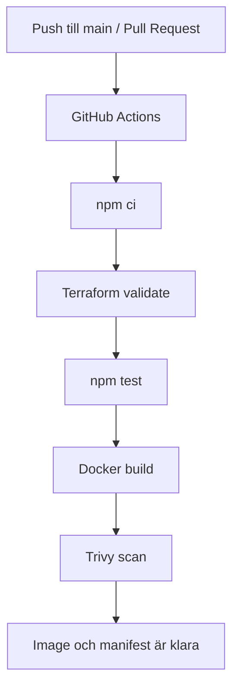
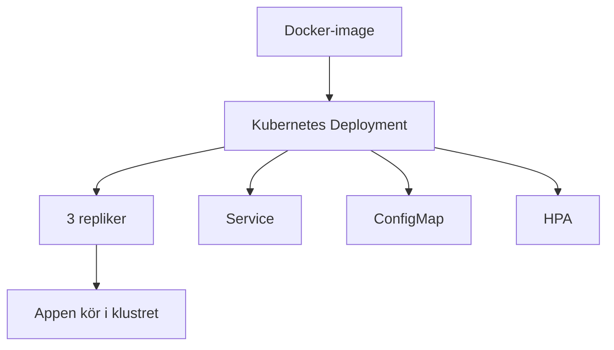

# Enkel Projektförklaring

## Vad Projektet Gör

Detta projekt är en liten Node.js- och Express-applikation som används för att visa ett enkelt DevSecOps-flöde.

Själva applikationen är mycket liten:

- `/` returnerar ett enkelt textsvar
- `/status` returnerar JSON med `status: ok` och en timestamp

Huvudsyftet med detta repo är inte bara appen i sig, utan också arbetsflödet runt den:

- testning
- Docker image build
- CI/CD med GitHub Actions
- Kubernetes-manifest
- Helm-chart
- Terraform-validering och infrastrukturstruktur
- grundläggande säkerhet och övervakning

## Helhetsbild

```text
Utvecklare pushar kod
        |
        v
 GitHub Actions-pipeline
        |
        +--> installerar beroenden
        +--> validerar Terraform
        +--> kör tester
        +--> bygger Docker-image
        +--> kör Trivy-säkerhetsskanning
        |
        v
 Image och deployfiler är klara
        |
        v
 Appen kan köras lokalt eller deployas manuellt
```

## Applikationsflöde

```mermaid
flowchart LR
    A[Användare] --> B[App]
    B --> C[/]
    B --> D[/status]
    C --> E[Enkelt textsvar]
    D --> F[JSON: status ok + timestamp]
```

## CI/CD-flöde



## Deployflöde



## Vad Vi Har Byggt

### 1. Applikation

Vi har byggt en enkel Express-app som visar om systemet fungerar som det ska.

### 2. CI/CD

Vi har byggt en GitHub Actions-pipeline som:

- installerar beroenden
- validerar Terraform
- kör tester
- bygger Docker-imagen
- kör en Trivy-säkerhetsskanning

Detta ger oss en automatisk kvalitets- och säkerhetskontroll när kod pushas till `main` eller när en pull request riktas mot `main`.

### 3. Docker

Vi har containeriserat appen med Docker.

Det betyder att:

- appen kan köras på samma sätt i olika miljöer
- den är enkel att starta lokalt
- den är förberedd för deployment till Kubernetes

Containern innehåller också:

- en health check
- körning som non-root
- en liten Alpine-baserad image

### 4. Kubernetes

Vi har skapat Kubernetes-manifest för:

- namespace
- configmap
- deployment
- service
- horizontal pod autoscaler

Detta gör att appen kan köras med flera repliker och skalas upp vid behov.

### 5. Helm

Vi har också skapat en Helm-chart för att göra deployment enklare att hantera och anpassa.

Det gör det enklare att:

- uppdatera appen
- ändra antalet repliker
- byta image-taggar
- återanvända deploymenten i olika miljöer

### 6. Terraform

Vi har inkluderat Terraform för att validera infrastrukturkonfiguration och för att visa en struktur för Infrastructure as Code.

Repot innehåller:

- provider-konfiguration
- variabler
- outputs
- en återanvändbar Kubernetes-modul

Terraform-delen visar en återanvändbar Kubernetes-struktur i repot. Den är kopplad till projektets helhet, men är separat från deployment-manifesten för den lilla Express-appen.

### 7. Säkerhet

Säkerhet finns med på ett enkelt men tydligt sätt:

- Trivy skannar Docker-imagen i CI
- containern kör som non-root-användare
- Kubernetes droppar Linux-capabilities
- privilege escalation är avstängt
- resource limits är definierade

### 8. Övervakning och Drift

Detta repo innehåller inte en full monitoreringsstack som Prometheus eller Grafana.
Men det innehåller grundläggande drift- och övervakningsfunktioner:

- `/status`-endpoint
- Docker health check
- Kubernetes liveness probe
- Kubernetes readiness probe
- loggar via `kubectl logs`
- autoskalning via HPA

## Sammanfattning I En Mening

Detta projekt visar hur en mycket liten applikation kan stöttas av ett enkelt DevSecOps-flöde med testning, containers, CI/CD, Kubernetes-filer, säkerhetskontroller och grundläggande övervakning.
